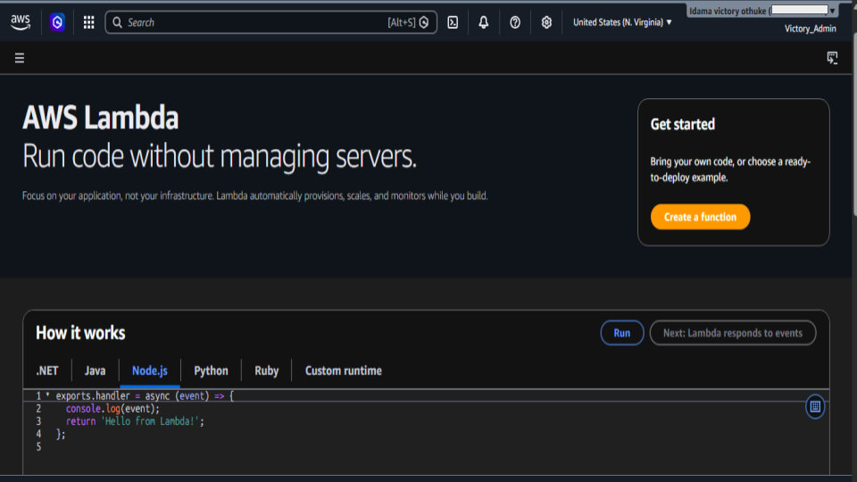
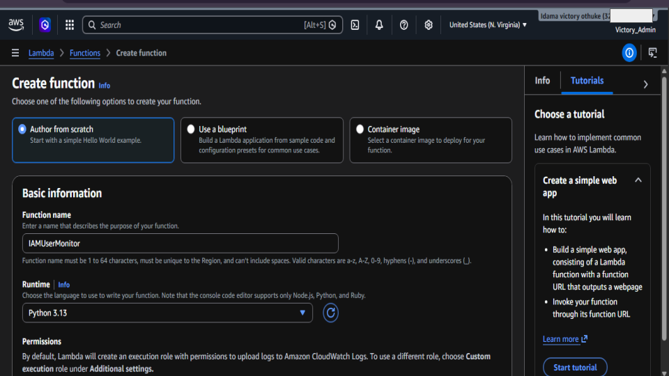
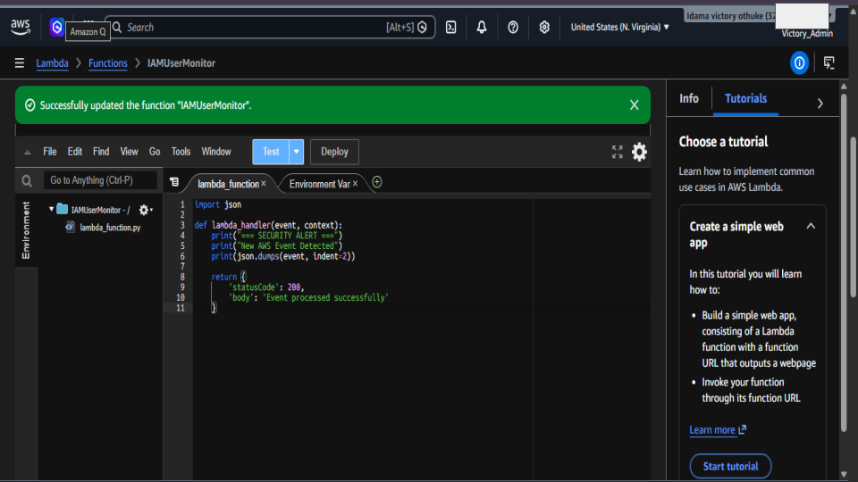
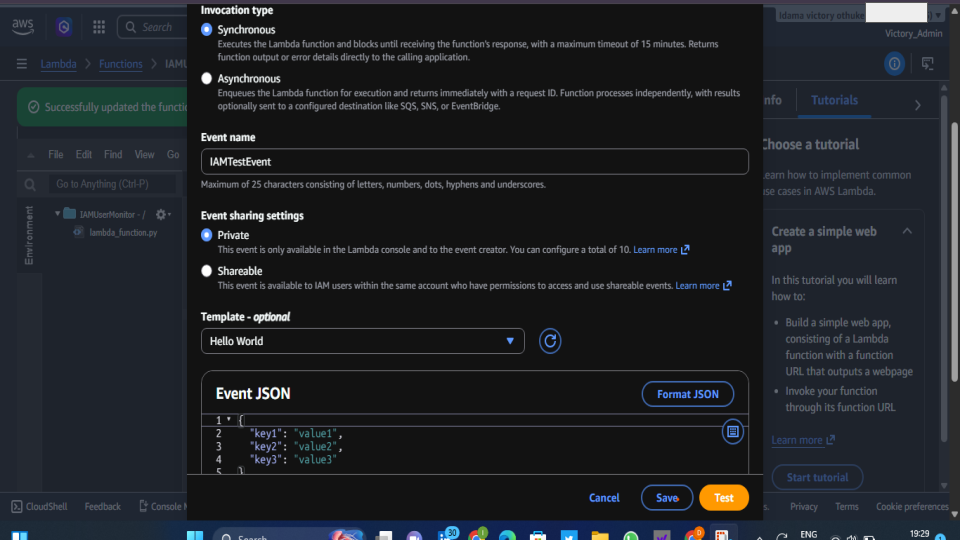
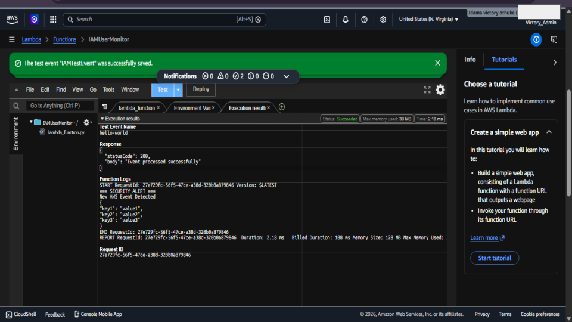
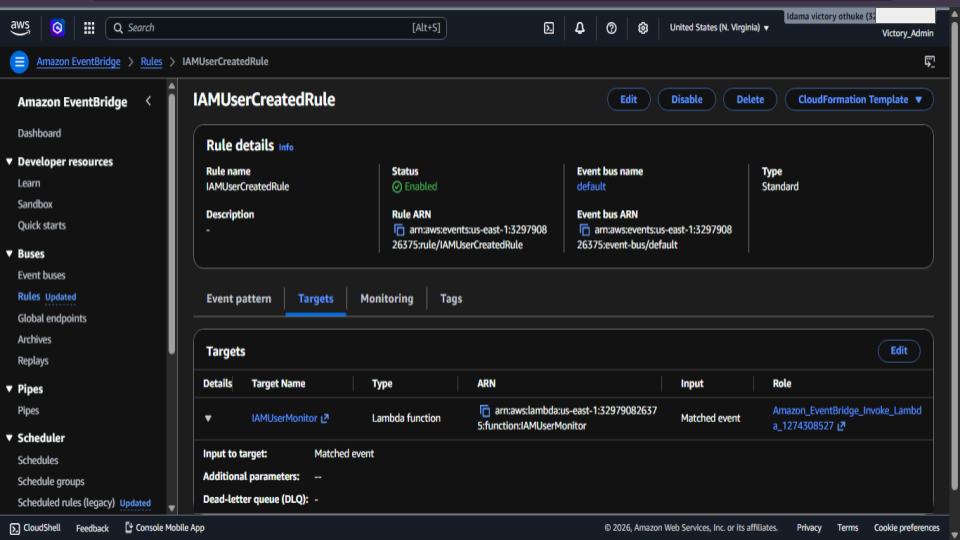
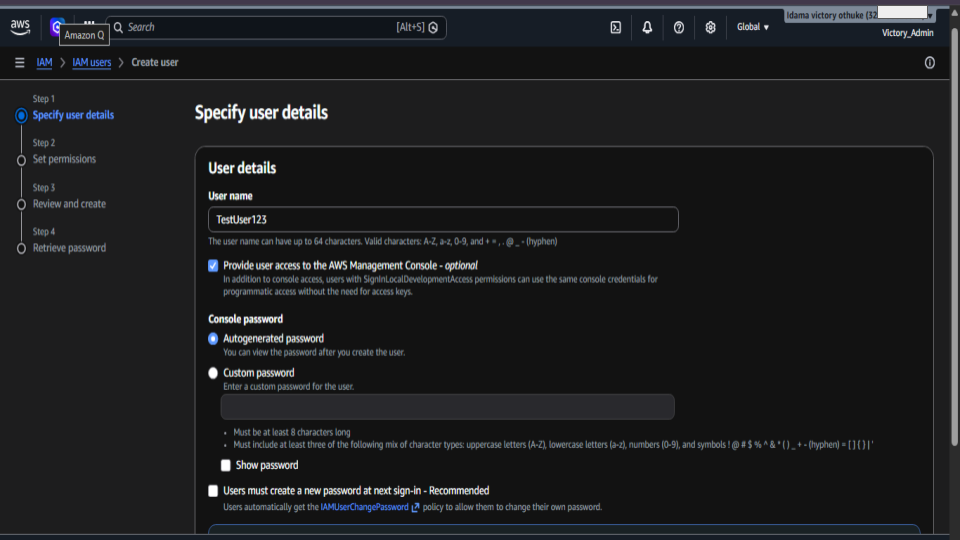
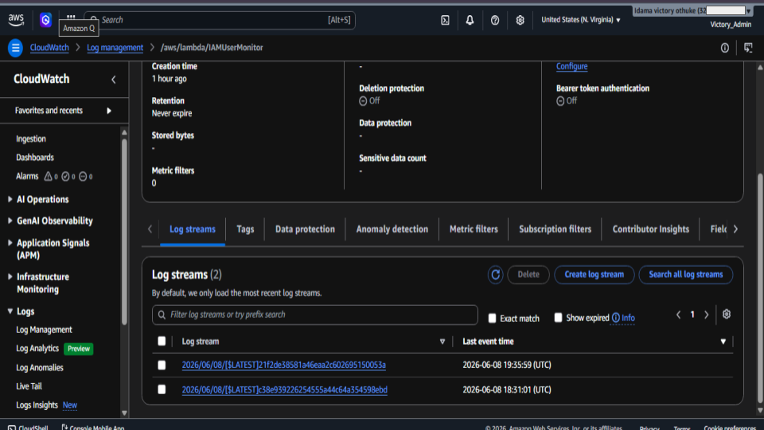
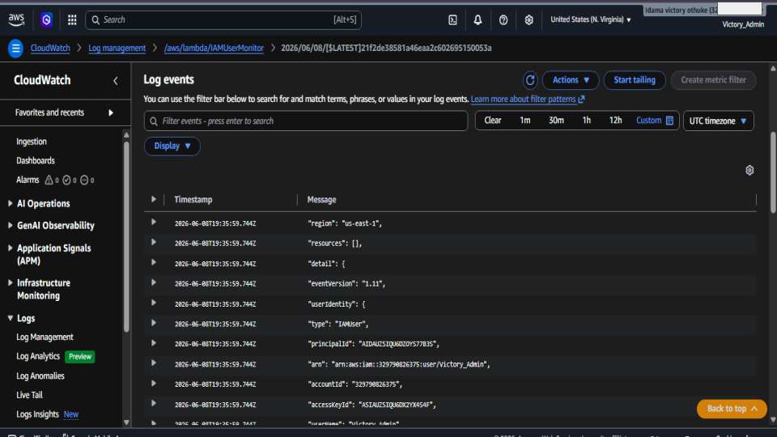

# AWS Lambda IAM User Monitoring Lab

## Project Overview

This project demonstrates how to build an automated AWS security monitoring solution using AWS Lambda, CloudTrail, EventBridge, and CloudWatch Logs.

The solution detects IAM user creation activities in an AWS account and automatically triggers a Lambda function to capture and log the event for security monitoring and auditing purposes.

---

## Objective

To create a serverless security monitoring workflow that:

- Detects IAM user creation events
- Processes events automatically using AWS Lambda
- Logs security events to Amazon CloudWatch
- Demonstrates event-driven security automation in AWS

---

## Architecture

```text
IAM User Creation
        │
        ▼
   CloudTrail
        │
        ▼
   EventBridge
        │
        ▼
 Lambda Function
        │
        ▼
 CloudWatch Logs
```

---

## AWS Services Used

- AWS IAM
- AWS Lambda
- AWS CloudTrail
- Amazon EventBridge
- Amazon CloudWatch Logs

---

## Implementation Steps

### 1. Created a Lambda Function

A Lambda function named **IAMUserMonitor** was created to process IAM-related events received from EventBridge.

### 2. Configured EventBridge Rule

An EventBridge rule was created to monitor IAM API activity captured through CloudTrail.

**Event Source**
- IAM

**Event Type**
- AWS API Call via CloudTrail

### 3. Connected EventBridge to Lambda

The Lambda function was configured as the target for the EventBridge rule, allowing automatic execution whenever a matching IAM event occurs.

### 4. Generated Test Activity

A new IAM user named **TestUser123** was created to validate the monitoring workflow.

### 5. Verified Detection

CloudWatch Logs confirmed that:

- CloudTrail captured the IAM event
- EventBridge matched the event pattern
- Lambda executed successfully
- User creation details were recorded in CloudWatch Logs

---

## Security Benefits

- Automated monitoring of IAM activities
- Improved visibility into account changes
- Event-driven security alerting
- Serverless and cost-effective architecture
- Supports cloud security monitoring and auditing

---

## Key Learning Outcomes

Through this lab, I gained hands-on experience with:

- AWS Lambda
- Event-driven architecture
- AWS CloudTrail logging
- Amazon EventBridge
- CloudWatch monitoring
- IAM activity auditing
- Cloud security automation


### 📊 Evidence 

<h4 align="center">In this step, I began my AWS Lambda IAM User Monitoring project by accessing the AWS Lambda service.</h4>

<p align="center">
    
</p>
n
<h4 align="center">In this step, I created a new AWS Lambda function called IAMUserMonitor. I selected Author from Scratch and used Python 3.13 as the runtime</h4>

<p align="center">
    
</p>

<h4 align="center">In this step, I wrote the Python code for my Lambda function. The function captures incoming AWS events, prints the event details, and generates a security alert message</h4>

<p align="center">
    
</p>

<h4 align="center">In this step, I created a test event called IAMTestEvent and used a sample JSON payload to test the Lambda function.</h4>

<p align="center">
    
</p>

<h4 align="center">In this step, I tested the Lambda function and confirmed that it executed successfully</h4>

<p align="center">
    
</p>

<h4 align="center">In this step, I created an Amazon EventBridge rule called IAMUserCreatedRule. The purpose of this rule was to monitor AWS events and detect when a new IAM user is created.</h4>

<p align="center">
    
</p>

<h4 align="center">In this step, I created a new IAM user named TestUser123. This was done intentionally to generate an IAM user creation event and test whether my EventBridge rule and Lambda function would detect and process the activity automatically.</h4>

<p align="center">
    
</p>

<h4 align="center">In this step, I accessed Amazon CloudWatch Logs to verify that the Lambda function was triggered successfully.</h4>

<p align="center">
    
</p>

<h4 align="center">In this final step, I reviewed the CloudWatch log events generated by the Lambda function. The logs showed detailed information about the IAM user creation event, including the user identity, account information, and event details.</h4>

<p align="center">
    
</p>


All screenshots are here:

🔗 [Google Slides](https://docs.google.com/presentation/d/1EsqnCI0XSV8SfDHFgaEcDLG-pIJHKZZaBytiVADBcl4/edit?usp=sharing)

> Note: Sensitive account information was blurred for security purposes before publication.

## Conclusion

This project demonstrates how AWS serverless services can be integrated to automatically monitor IAM activities. By combining CloudTrail, EventBridge, Lambda, and CloudWatch, security-relevant events can be detected, processed, and logged without manual intervention, providing greater visibility into AWS account activity.

## Author
Idama Victory Othuke
